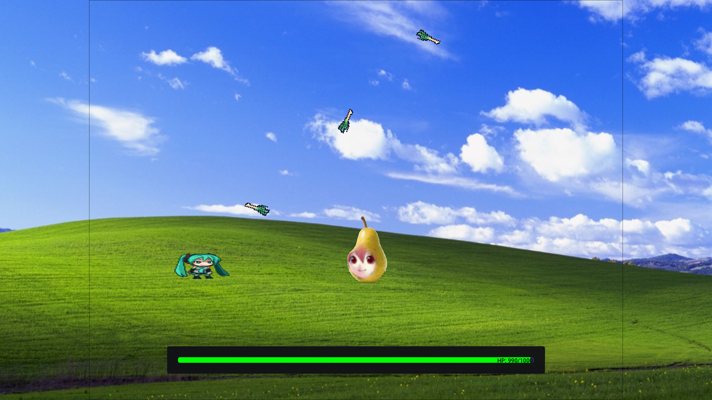

# Barn

A cross-platform multiplayer 2D bullet hell game with a custom engine using Entt, Box2D and SDL3.

Inspired by *Touhou Project*, *Rabbit and Steel* and *Risk of Rain*.

## How to build

    git submodule update --init --recursive
	mkdir build
    cmake -S . -B build
    cmake --build build

## How to run

    cd build
    ./barn
